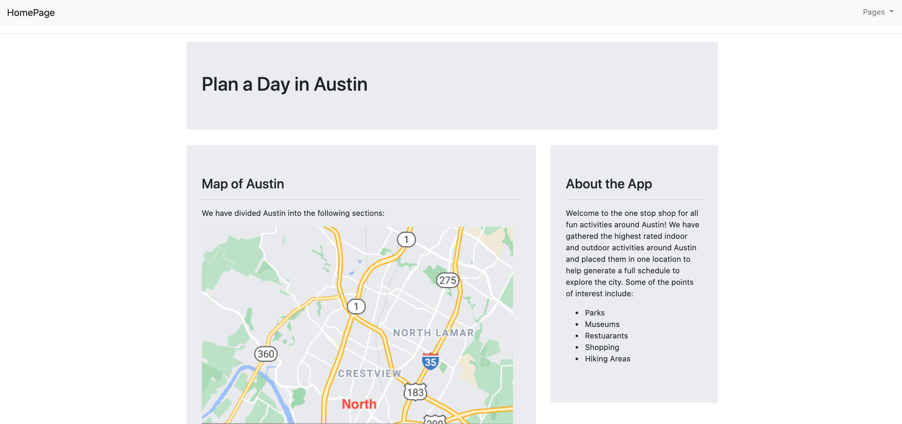

## Project 2

#### Plan a Day in Austin
A Full stack web application that helps create a schedule of a day in Austin based on top recommened places!

Direct link to app: https://hip-cal-2.herokuapp.com/

#### Home page 

#### Result:

In this application we utilized the Google Places API to implement a search for the most popular attractions in Austin, Texas. Ultimately, Plan a Day in Austin allows the user to generate a schedule to explore the city. Users can also submit recommendations to add to our database of popular spots in town to help spread the word of hidden gems around Austin. 

#### Technologies and Packages used:

Postgresql (Database)

Bootstrap (Front-end framework)

Heroku (Cloud platform)

Mapbox

Plotly

## Author
Akik Patel, Caroline Moeser, Ed Yancik, Natalia Saavedra, Zach Childers
